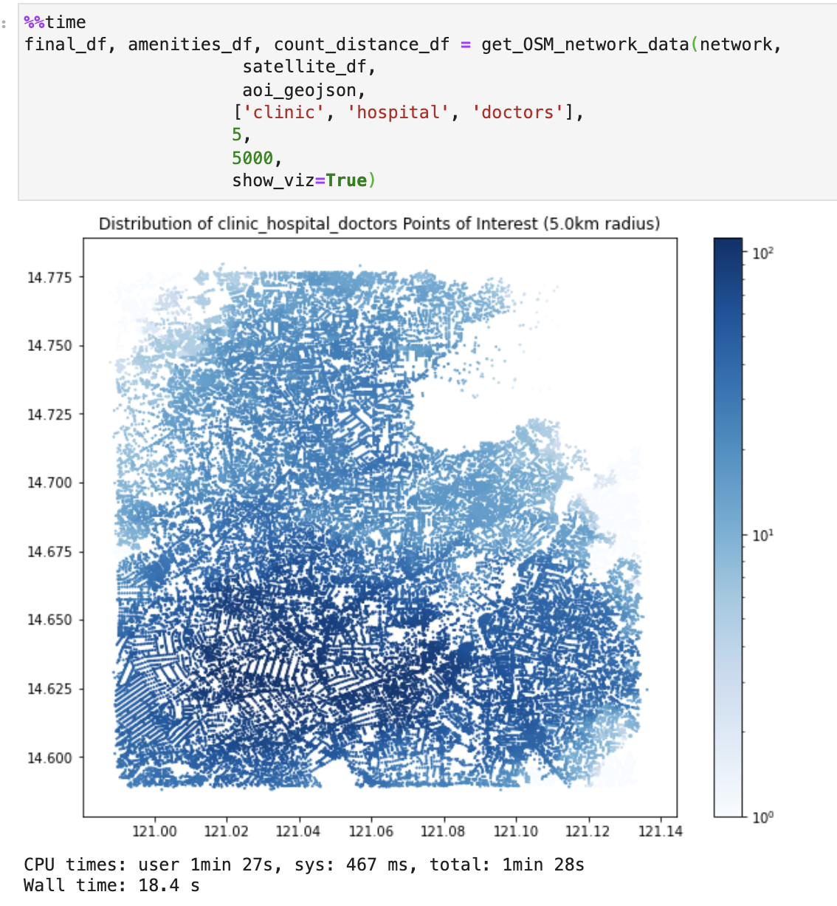
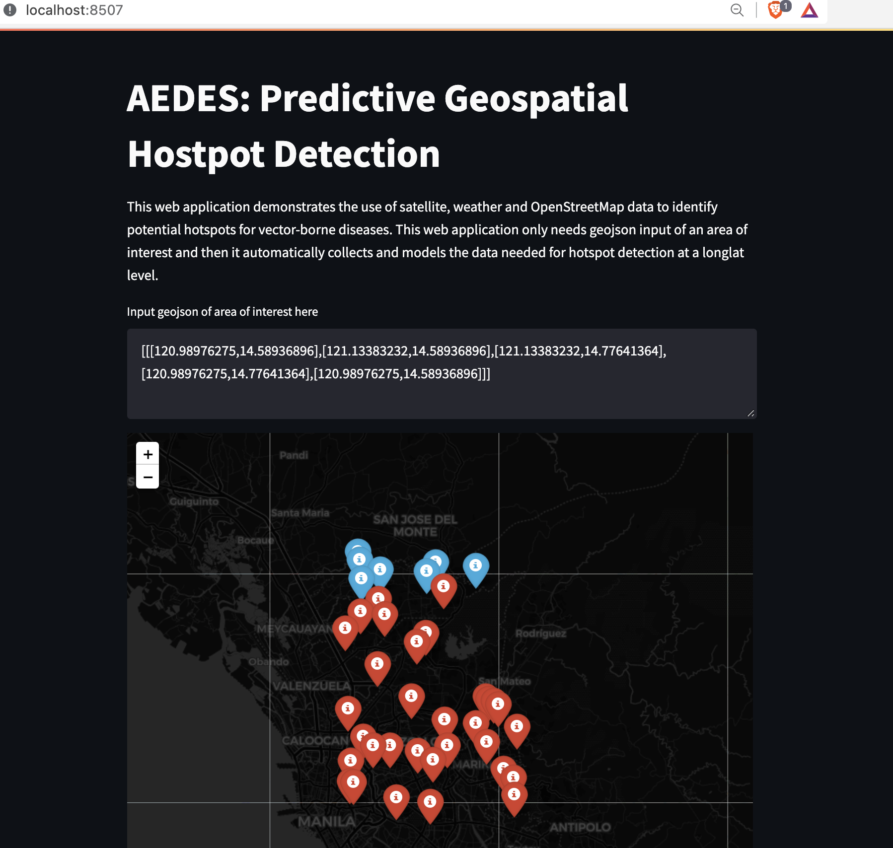

# AEDES

This repository contains codes that demonstrate the use of Project AEDES for data collection on remote sensing using LANDSAT, MODIS and SENTINEL. Full repository is linked [here](https://github.com/xmpuspus/aedes).

Author: Xavier Puspus  
Affiliation: [Cirrolytix Research Services](cirrolytix.com)

### Installation


Install using:

```console
foo@bar:~$ pip install aedes
```


# Satellite Data

Import the modules of the package using:

```
import aedes
from aedes.remote_sensing_utils import get_satellite_measures_from_AOI
from aedes.remote_sensing_utils import perform_clustering, visualize_on_map

from aedes.osm_utils import reverse_geocode_points
```

### Authentication and Initialization
This packages uses Google Earth Engine (sign-up for access [here](https://earthengine.google.com/signup/)) to query remote sensing data. To authenticate, simply use:

```
aedes.remote_sensing_utils.authenticate()
```

This script will open a google authenticator that uses your email (provided you've signed up earlier) to authenticate your script to query remote sensing data. After authentication, initialize access using:

```
aedes.remote_sensing_utils.initialize()
```

### Area of Interest

First, find the bounding box geojson of an Area of Interest (AOI) of your choice using this [link](https://boundingbox.klokantech.com/).


### Get Normalized Difference Indices and Weather Data

Use the one-liner code `get_satellite_measures_from_AOI` to extract NDVI, NDWI, NDBI, Aerosol Index (Air Quality), Surface Temperature, Precipitation Rate and Relative Humidity for your preset number of points of interest `sample_points` within a specified date duration `date_from` to `date_to`.

```
%%time
QC_AOI = [[[120.98976275,14.58936896],
           [121.13383232,14.58936896],
           [121.13383232,14.77641364],
           [120.98976275,14.77641364],
           [120.98976275,14.58936896]]] # Quezon city

qc_df = get_satellite_measures_from_AOI(QC_AOI, 
                                              sample_points=200, 
                                              date_from='2017-07-01', 
                                              date_to='2017-09-30')
```

### Reverse Geocoding

This package also provides an easy-to-use one-liner reverse geocoder that uses [Nominatim](https://nominatim.org/)

```
%%time
rev_geocode_qc_df = reverse_geocode_points(qc_df)
rev_geocode_qc_df.head()
```

### Geospatial Clustering

This packages uses KMeans as the unsupervised learning technique of choice to perform clustering on the geospatial data enriched with normalized indices, air quality and surface temperatures with your chosen number of clusters.

```
rev_geocode_qc_df['labels'] = perform_clustering(rev_geocode_qc_df, 
                                     n_clusters=3)
```

### Visualize Hotspots on a Map

This packages also provides the capability of visualizing all the points of interest with their proper labels using one line of code.

```
vizo = visualize_on_map(rev_geocode_qc_df)
vizo
```


# OpenStreetMap Data


The package needed is imported as follows:

```
from aedes.osm_utils import initialize_OSM_network, get_OSM_network_data 
```

### Spatial Data from Map Networks

In order to initialize and create an OpenStreetMap (OSM) network from a geojson of an AOI, use:


```
%%time
network = initialize_OSM_network(aoi_geojson)
```


### Query Amenities Data 

In order to pull data for, say, healthcare facilities (more documentation on amenities [here](https://wiki.openstreetmap.org/wiki/Map_features#Amenity)), use this one-liner:

```
final_df, amenities_df, count_distance_df = get_OSM_network_data(network,
                     satellite_df,
                     aoi_geojson,
                    ['clinic', 'hospital', 'doctors'],
                    5,
                    5000,
                    show_viz=True)
```




This function pulls the count and distance of each node from a possible healthcare facility (for this example). It also outputs the original dataframe concatenated with the count and distances. The actual amenities data is also returned. We can then pass the resulting `final_df` dataframe into another clustering algorithm to produce dengue risk clusters with the added health capacity features.


# AEDES Demo Web Application

In order to demonstrate the functionalities of using the AEDES python package, we can use Streamlit to display a web application that takes in a geojson and outputs the hotspots and the recommended cities at risk. Clone this repository, `cd` into it and follow the instructions below.

### Streamlit Setup

Install streamlit using:

```console
foo@bar:~$ pip install streamlit
```

Run `streamlit hello` to see if the installation was successful.

### Running the sample web application 

Simply run the code below to run a local version of your web application that outputs the at-risk areas as hotspots on a map as well as a subsequent list of places to prioritize disease-related proactive measures.  

The one below is for a dengue hotspot map for Quezon City, Philippines.



This other screenshot shows the web application demonstrating the use of the geospatial modelling in outputting locations of high-risk areas.


Another example for Cotabato City, Philippines is shown below.


